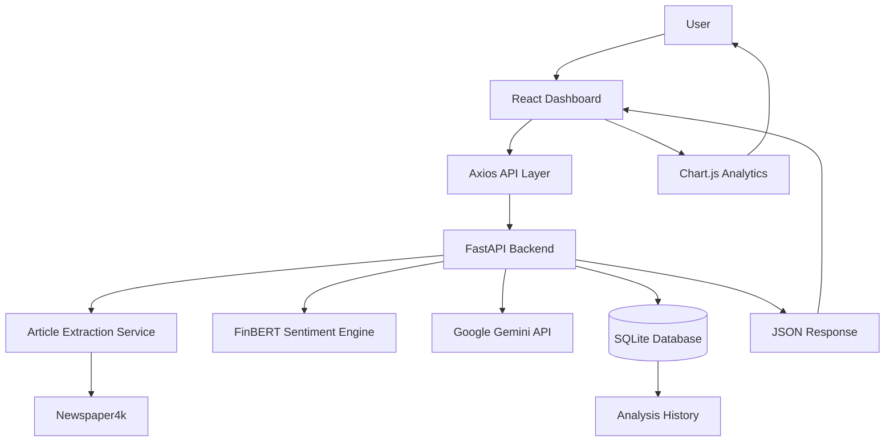

# 📊 Finsight: Financial News Sentiment Analyzer

Finsight is a full-stack AI-powered financial news sentiment analysis platform that evaluates financial news articles using Natural Language Processing (NLP), Large Language Models (LLMs), and interactive analytics dashboards.

The platform extracts article content from financial news URLs, performs sentiment analysis using FinBERT, generates concise AI-powered summaries using Google Gemini, and visualizes historical sentiment trends through an interactive dashboard.

---

# 📂 Repository Information

* **Project Name:** Finsight
* **Project Type:** Financial News Sentiment Analysis Platform
* **Architecture Style:** Client-Server Architecture
* **Frontend:** React + Vite
* **Backend:** FastAPI
* **Sentiment Engine:** FinBERT (ProsusAI/finbert)
* **AI Summarization:** Google Gemini
* **Article Extraction:** Newspaper4k

---

# 🏗️ Architecture Overview & System Design

Finsight follows a modular architecture where article extraction, sentiment analysis, AI summarization, persistence, and frontend visualization are separated into dedicated layers.

This approach improves maintainability, scalability, and code organization while keeping the application lightweight and easy to extend.

---

## 🧩 Project Topology

```text
Finsight/
│
├── backend/
│   ├── api/
│   │   └── sentiment.py
│   │
│   ├── core/
│   │   └── config.py
│   │
│   ├── database/
│   │   ├── database.py
│   │   └── models.py
│   │
│   ├── schemas/
│   │   └── sentiment.py
│   │
│   ├── services/
│   │   ├── article_extractor.py
│   │   ├── sentiment_service.py
│   │   └── summarizer_service.py
│   │
│   └── main.py
│
├── frontend/
│   ├── src/
│   │   ├── components/
│   │   ├── pages/
│   │   ├── services/
│   │   └── assets/
│   │
│   └── package.json
│
└── README.md
```

---

## 🔄 High-Level Architecture Flow



---

# ⚙️ Core Business Workflow

## 📰 Article Analysis Workflow

### 1. User Submission

The user submits a financial news article URL.

Example:

```text
https://finance.yahoo.com/...
https://www.marketwatch.com/...
https://www.reuters.com/...
```

---

### 2. Article Extraction

The backend extracts:

* Article title
* Article content
* Metadata

using Newspaper4k.

---

### 3. Sentiment Analysis

The extracted article is processed through FinBERT.

FinBERT predicts:

* Positive
* Negative
* Neutral

and generates a confidence score.

---

### 4. AI Summarization

The article content is sent to Google Gemini.

Gemini generates:

* Concise article summary
* Key business impact
* Major financial outcomes

---

### 5. Persistence Layer

The analysis result is stored in SQLite.

Stored fields:

```text
id
article_url
title
sentiment
confidence
summary
created_at
```

---

### 6. Frontend Visualization

Results are displayed through:

* Sentiment Result Card
* Analysis History
* Sentiment Distribution Pie Chart
* Confidence Score Bar Chart

---

# 🧠 Analytical Components

## 📈 FinBERT Sentiment Engine

FinBERT is a domain-specific transformer model trained on financial text.

### Output Categories

| Sentiment | Description                       |
| --------- | --------------------------------- |
| Positive  | Favorable financial outlook       |
| Neutral   | Balanced or informational content |
| Negative  | Unfavorable financial outlook     |

The model also returns a confidence score for every prediction.

---

## 🤖 AI Summarization Layer

Google Gemini generates concise summaries from extracted article content.

### Responsibilities

* Financial news summarization
* Business impact extraction
* Investor-friendly explanations
* Natural language synthesis

---

# 📊 Analytics Dashboard

The frontend dashboard provides historical insights into analyzed articles.

### Sentiment Distribution

Pie chart displaying:

* Positive Articles
* Negative Articles
* Neutral Articles

### Confidence Scores

Bar chart displaying:

* Sentiment confidence scores
* Historical analysis confidence comparisons

---

# 🚀 Architecture Features

## Modular Backend Design

Responsibilities are separated into dedicated services:

* Article Extraction Service
* Sentiment Analysis Service
* Summarization Service
* Database Layer

---

## Database Persistence

Analysis results are stored in SQLite for:

* Historical tracking
* Dashboard analytics
* Future extensibility

---

## Interactive Analytics Dashboard

Visualized using Chart.js:

* Sentiment Distribution
* Confidence Score Analysis

---

## Responsive Frontend

Built with:

* React
* Vite
* Tailwind CSS

Supports:

* Desktop
* Tablet
* Mobile Devices

---

# 🛠️ Tech Stack

## Frontend

* React 19
* Vite
* Tailwind CSS
* Axios
* Chart.js
* React Chart.js 2

## Backend

* FastAPI
* Python 3.12
* Uvicorn
* SQLAlchemy
* Pydantic

## NLP & AI

* FinBERT (ProsusAI/finbert)
* Google Gemini 2.5 Flash

## Article Processing

* Newspaper4k

## Database

* SQLite

---

# ▶️ Getting Started

## Prerequisites

### Backend

* Python 3.12+
* Pip

### Frontend

* Node.js 18+
* npm

---

## Backend Setup

```bash
cd backend

python -m venv venv

venv\Scripts\activate

pip install -r requirements.txt
```

Create a `.env` file:

```env
GEMINI_API_KEY=your_api_key_here
```

Start the backend:

```bash
uvicorn backend.main:app --reload --port 8001
```

Backend URL:

```text
http://localhost:8001
```

---

## Frontend Setup

```bash
cd frontend

npm install

npm run dev
```

Frontend URL:

```text
http://localhost:5173
```

---

# 📡 API Documentation

| Method | Endpoint      | Description                      |
| ------ | ------------- | -------------------------------- |
| POST   | /analyze      | Analyze a financial news article |
| GET    | /history      | Retrieve analysis history        |
| GET    | /history/{id} | Retrieve a specific analysis     |

---

# ✅ Current MVP Features

### Completed

✅ Article URL Analysis

✅ Financial News Extraction

✅ FinBERT Sentiment Classification

✅ AI-Generated Summaries

✅ SQLite Persistence

✅ Analysis History

✅ Sentiment Distribution Dashboard

✅ Confidence Score Dashboard

✅ FastAPI REST APIs

✅ Responsive React Frontend

---

# 🗺️ Future Roadmap

### Phase 2

* Improved Dashboard UI/UX
* Advanced Analytics Metrics
* Search & Filter Analysis History
* Export Analysis Results

### Phase 3

* User Authentication
* Saved User Analyses
* Multi-Source Financial News Support
* Sentiment Trend Tracking

### Phase 4

* Real-Time News Monitoring
* Watchlist-Based Analysis
* AI Investment Insight Layer
* Portfolio-Level Sentiment Tracking

---

# 🎯 Learning Outcomes

This project demonstrates:

* Full-Stack Development
* REST API Design
* NLP Pipeline Development
* Financial Sentiment Analysis
* AI Integration
* Data Persistence
* Data Visualization
* Dashboard Development
* Client-Server Architecture

---

# 👩‍💻 Author

**Inchara Gowda**

Entry level Full-Stack AI Developer

Focused on:

* Artificial Intelligence
* Machine Learning
* Financial Analytics
* Data Science
* Full-Stack Development

---

⭐ If you find this project useful, consider starring the repository.
